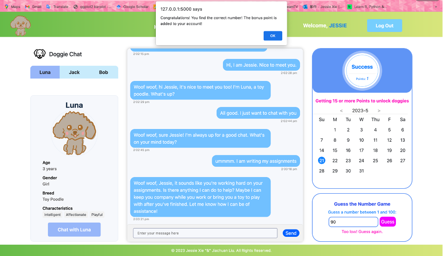

# 🐶 Doggie Chat
**Authors:**<br>
Jessie Xie (21918545) <br>
Jiachuan Liu (23292749)

## 💡 Purpose

The purpose of the Doggie Chat web application is to provide a platform for users to interact and chat with AI puppies. Dogs are known to be loyal friends of humans, but it can be challenging to understand their words in the real world. With Doggie Chat, users can engage in conversations and interact with six different AI dogs, each with their own unique personalities.

### Design and Use

The web application is designed with the following components:

#### Opening View

The opening view consists of three main parts:

1. Register: Users need to register an account by providing necessary information, including an email address for verification purposes.
2. Login: Registered users can log in to access the chat and search pages.
3. Reset: In case users forget their password, they can reset it through the reset password page. Users need to provide their email address for verification purpose


#### Chat View

The chat view is the main section where users can engage in conversations with the AI dogs. This section is divided into three parts:

1. Dog Selection: Upon logging in, users can choose from three different dogs to chat with. Each dog has its own distinct personality and characteristics.
2. Chat Interface: Once a dog is selected, users can start conversing with the chosen dog. They can exchange messages and have interactive conversations.


3. Check-in and Mini-games: The chat page also includes a check-in feature. Users can check in once a day, earning one point for each check-in. Additionally, a number guessing mini-game is presented after check-in. Successfully completing the mini-game grants the user an extra point. The mini-game disappears once completed, ensuring users can earn a maximum of two points per day. After earning 15 points or more, the user unlocks the ability to chat with the other three dogs.





#### Search View

In the search view, users have the ability to search through their historical chat records. They can filter the records based on the dog they interacted with or specific days.


The Doggie Chat web application provides users with an enjoyable and interactive platform to chat with AI puppies. By offering different dogs with unique personalities and incorporating features like check-ins and mini-games, users can have a rewarding experience while engaging with the virtual canine companions.

## ⚙️ Architecture

The Doggie Chat web application follows a client-server architecture, with a simple and lightweight database setup using SQLite. Here is an overview of the application's architecture:

1. **Client-Side**:
   - The client-side of the application is built using HTML, CSS, AJAX, jQuery, and Bootstrap.
   - **HTML**: Provides the structure and content of the web pages.
   - **CSS**: Used for styling the user interface and creating an appealing visual experience.
   - **AJAX**: Enables asynchronous communication between the client and server, allowing for dynamic content updates without requiring a page refresh.
   - **jQuery**: A JavaScript library that simplifies client-side scripting and provides a wide range of useful functions for DOM manipulation and event handling.
   - **Bootstrap**: A popular front-end framework that offers pre-designed CSS and JavaScript components for building responsive and mobile-friendly web applications.

2. **Server-Side**:
   - The server-side of the application is implemented using Python and the Flask framework.
   - Flask is a lightweight web framework that handles the routing, request handling, and response generation.
   - The server interacts with the client through HTTP(S) requests and responses.
   - It handles user registration, login, password reset, and other user-related functionalities.
   - The server also manages the AI chatbot logic, which processes user messages and generates responses.
   - The server communicates with the OpenAI API to utilize the AI models for generating dog-like responses.
   - The server uses Flask-SQLAlchemy to perform CRUD operations in the database.

3. **Database**:
   - The Doggie Chat web application uses SQLite as the database system.
   - SQLite stores user information, chat history, and other relevant data in a single file.
   - It provides a lightweight and efficient solution for managing the application's data without requiring additional database software.
   - Database schema:

   

4. **API Integration**:
   - The Doggie Chat web application integrates with external APIs to enhance its functionality.
   - It utilizes the OpenAI API for the AI chatbot's natural language processing capabilities, allowing the dogs to generate contextually relevant responses.
   - Additionally, an email API is used for sending verification emails, password reset emails, and other email notifications to the users.

5. **Security**:
   - The web application incorporates security measures to protect user data and ensure a secure experience.
   - User passwords are stored using secure hashing techniques, preventing unauthorized access to sensitive information.
   - User authentication and authorization mechanisms are implemented to control access to the application's features and resources.

The Doggie Chat web application architecture provides a simple and efficient platform for users to chat with AI puppies. It leverages client-side technologies like HTML, CSS, AJAX, jQuery, and Bootstrap, along with server-side technologies and database management, to deliver a seamless and engaging user experience.


## 💻 How to launch the web application

To launch the Doggie Chat web application locally, follow these steps:

1. **Set up the environment**:
   - Download and install Python from the official Python website: [python.org](https://www.python.org/downloads/).
   - Install a code editor such as Visual Studio Code (VSCode) from: [code.visualstudio.com](https://code.visualstudio.com/).
   - Clone the repository to your local machine using Git. Open a terminal or command prompt and navigate to the cloned repository directory:
     ```
     git clone https://github.com/Doggie-Chat/DoggieChat.git
     cd DoggieChat
     ```
   - Migrate the repository to your local repository (optional)
     ```
     git remote add <your new remote name> <your new repository URL>
     git push <your new remote name> <branch name>
     ```
   - Create a virtual environment:
     - For Windows (using Command Prompt):
       ```
       python -m venv webchat-env
       ```
     - For Windows (using PowerShell):
       ```
       python -m venv webchat-env
       ```
     - For Unix/Linux:
       ```
       python3 -m venv webchat-env
       ```
   - Activate the virtual environment:
     - For Windows (using Command Prompt):
       ```
       .\webchat-env\Scripts\activate
       ```
     - For Windows (using PowerShell):
       ```
       .\webchat-env\Scripts\Activate.ps1
       ```
     - For Unix/Linux:
       ```
       source webchat-env/bin/activate
       ```

2. **Install required packages**:
   - Make sure you are in the Doggie Chat repository directory with the virtual environment activated.
   - Install the required packages by running the following command:
     ```
     pip install -r requirements.txt
     ```

3. **Configure API Keys**:
   - Obtain your OpenAI API key and email API key.
   - Open the `app.py` file in the code editor.
   - Locate the following lines:
     ```python
     openai.api_key = '' # your openai api key
     openai.organization = '' # your openai organization id
     ```
     Replace the empty strings `''` with your OpenAI API key.
   - Similarly, find the lines:
     ```python
     host_server = ''  # your email host server
     sender_mail = '' # your sender email
     pwd = '' # your sender email key
     ```
     Replace the empty string `''` with your email API key.

4. **Run the application**:
   - Make sure you are still in the Doggie Chat repository directory with the virtual environment activated.
   - Start the application by running the following command:
     ```bash
     cd flask
     flask run
     ```

5. **Access the Doggie Chat web application**:
   - Open your web browser and enter the following URL: `http://localhost:5000`

Now you can enjoy chatting with the AI puppies on the locally hosted Doggie Chat web application. If you encounter any issues, make sure to double-check the steps and ensure that the API keys are correctly configured.


## 🔧 How to run tests
## Unit Tests

Unit tests for the Doggie Chat web application cover three main parts: the login system, chat functionality, and chat history. Here is a description of the unit tests and instructions on how to run them:

### Login System Part

#### Login Page:
- Test the correct login by providing valid credentials.
- Test an incorrect password to verify the error handling.
- Test a non-existent user to ensure appropriate error handling.

#### Register Page:
- Test a correct registration by providing valid user information.
- Test the email verification process for an already registered email.
- Test an incorrect email format to validate the error handling.
- Test an incorrect email verification code to ensure appropriate error handling.
- Test an already existing username to verify the error handling.

#### Reset Page:
- Test a non-existent username to ensure appropriate error handling.
- Test an incorrect password length to validate the error handling.
- Test the correct steps to reset the password.
- Test an incorrect email to verify the error handling.
- Test an incorrect username to ensure appropriate error handling.
- Test an incorrect email verification code to validate the error handling.

### Chat Part

- Test the answer function to ensure the chatbot can reply appropriately to user messages.
- Test the switch function to ensure users can switch between different dogs for chatting.
- Test the check-in functionality to verify if users can successfully check-in.
- Test the game bonus functionality to ensure users receive the bonus point for completing the mini-game.

### History Part

- Test various conditions to search and retrieve the user's chat history.

### Running the Unit Tests:

To run the unit tests for the Doggie Chat web application, follow these steps:

1. Enter the environment with the required packages. Make sure you have all the necessary dependencies installed.
2. Stop running the flask app, by pressing `Ctrl + C`
3. Run the `flasktest.py` script while being in the environment. Make sure you are in the `flask` folder
     ```bash
     python -m tests.flasktest
     ```
 4. Unit tests result:

 

 
Note: The unit tests should succeed during the first run. However, when running the tests again after the initial success, failures may occur in the register test because the new account has already been created in the database during the first run of the test script. If you still want to run the test script multiple times, ensure that you remove the record of the `username test4` from both the `checkin` and `user` tables in the database.

Running the unit tests helps ensure that different parts of the Doggie Chat web application function correctly and as intended. It validates the behavior of the login system, chat functionality, and chat history, providing confidence in the application's overall reliability.

### User tests
User tests simulate users' activities to ensure that the Doggie Chat web application functions correctly. The tests cover all three views: opening, chat, and search. Follow the instructions below to run the user tests:

1. **Ensure Flask Server is Running**:
   - Before running the user tests, make sure that one terminal is running the Flask server. If not, start the server by navigating to the `flask` folder of the Doggie Chat application and executing the following command:
     ```bash
     flask run
     ```

2. **Navigate to the `flask` Folder**:
   - Open a new terminal or command prompt and navigate to the `flask` folder of the Doggie Chat repository. Use the following command:
     ```bash
     cd flask
     ```

3. **Run the User Tests**:
   - Execute the following command to run the user tests:
     ```bash
     python -m tests.usertest
     ```
4. **User Tests Results**:

   - 
 
 
Running the above command will execute the user tests and verify the functionality of the web application. Note that if you want to run the user tests again within the same day, you need to modify the data for the `testuser` in the database. Specifically, you should follow these steps:

1. Access the database used by the Doggie Chat web application.
2. Locate the `checkin` table within the database.
3. Find the row corresponding to the `testuser` account.
4. Update the `last_login` and `current_login` values for the `testuser` to the previous day's date.
   - This step ensures that the functions related to the test mini-game work correctly during subsequent test runs.
5. Save the changes to the database.

## 🗓️ Commit logs
In the project, Jiachuan contributes 50% and focuses on the back-end development and unit testing. Jessie also contributes 50% and focuses on front-end development and user testing.
```
* commit 7acc827ea4e9f4f764dd35eb9d62ace87ee3cade (HEAD -> main, origin/main, origin/HEAD)
| Author: JessieXie111 <82140642+JessieXie111@users.noreply.github.com>
| Date:   Sun May 21 14:32:15 2023 +0800
| 
|     Update .DS_Store
| 
* commit 28342ced089cce92de69e7d8d0db599e261081ca
| Author: JessieXie111 <82140642+JessieXie111@users.noreply.github.com>
| Date:   Sun May 21 14:32:02 2023 +0800
| 
|     Delete the virtual env
| 
* commit aa1328426911d596cf4c6892d9ccbee6d33bd7a4
| Author: JessieXie111 <82140642+JessieXie111@users.noreply.github.com>
| Date:   Sun May 21 14:28:30 2023 +0800
| 
|     Update test.db
|   
*   commit ced5e957c4159ba72d1bae98d9bc43c22d5986f6
|\  Merge: fa4cf99 5c4a27e
| | Author: JessieXie111 <82140642+JessieXie111@users.noreply.github.com>
| | Date:   Sun May 21 14:26:44 2023 +0800
| | 
| |     Merge branch 'main' of https://github.com/Doggie-Chat/DoggieChat
| | 
| * commit 5c4a27e3652c8b15fcd60bf6de878aeb0ac698ea
| | Author: JessieXie111 <82140642+JessieXie111@users.noreply.github.com>
| | Date:   Sun May 21 14:25:32 2023 +0800
| | 
| |     Update README.md
| | 
* | commit fa4cf993c6b5d49de88fa83c7a47022abff16990
| | Author: JessieXie111 <82140642+JessieXie111@users.noreply.github.com>
| | Date:   Sun May 21 14:26:41 2023 +0800
| | 
| |     Add requirements.txt
| | 
* | commit bab45b8f3f56802dcddf8efec53235bafb9ff296
|/  Author: JessieXie111 <82140642+JessieXie111@users.noreply.github.com>
|   Date:   Sun May 21 14:26:14 2023 +0800
|   
|       Delete unnecessary files
|   
*   commit 31da51d2f1b9f32b5e3ed47230b83882cb8f023e
|\  Merge: bc051b7 496d8c8
| | Author: JessieXie111 <82140642+JessieXie111@users.noreply.github.com>
| | Date:   Sun May 21 12:48:02 2023 +0800
| | 
| |     Merge branch 'main' of https://github.com/Doggie-Chat/DoggieChat
| | 
| * commit 496d8c8af55f3f6498b8a64552be2b76cef4ac97
| | Author: JessieXie111 <82140642+JessieXie111@users.noreply.github.com>
| | Date:   Sun May 21 12:47:12 2023 +0800
| | 
| |     Update README.md
| |     
| |     Version 1 of Readme. Some informations should be updated later
| | 
* | commit bc051b77052eab95be3fe8f8d20ffac46f130615
|/  Author: JessieXie111 <82140642+JessieXie111@users.noreply.github.com>
|   Date:   Sun May 21 12:47:47 2023 +0800
|   
|       Slightly modify the code
| 
* commit db9c174709d99e95b0139e7060544c6bba23804c
| Author: JessieXie111 <82140642+JessieXie111@users.noreply.github.com>
| Date:   Sat May 20 19:03:49 2023 +0800
| 
|     Modify the js code
| 
* commit 0f982660f2d1326aa1c191b5b0e13ae094e7b4be
| Author: JessieXie111 <82140642+JessieXie111@users.noreply.github.com>
| Date:   Sat May 20 18:57:02 2023 +0800
| 
|     Valid HTML and CSS
|   
*   commit ed776ffb7ec5cd2137c81cb8a18799e31e14dc50
|\  Merge: effcf98 9b2bcc9
| | Author: JessieXie111 <82140642+JessieXie111@users.noreply.github.com>
| | Date:   Sat May 20 18:23:57 2023 +0800
| | 
| |     Merge branch 'main' of https://github.com/Doggie-Chat/DoggieChat
| |   
| *   commit 9b2bcc9fd4ed0fc7b9db7cdfe53cc4549799ed78
| |\  Merge: 06ed41a 554fadc
| | | Author: Jiachuan Liu <a2681735200@gmail.com>
| | | Date:   Sat May 20 17:08:27 2023 +0800
| | | 
| | |     Merge branch 'main' of https://github.com/Doggie-Chat/DoggieChat
| | | 
| * | commit 06ed41a09135871248a99ff60489a0fcac67e6d8
| | | Author: Jiachuan Liu <a2681735200@gmail.com>
| | | Date:   Sat May 20 17:06:16 2023 +0800
| | | 
| | |     Update test.db
| | | 
* | | commit effcf98fa9ab1dc30eec1cae3f7cb84d99efde96
| |/  Author: JessieXie111 <82140642+JessieXie111@users.noreply.github.com>
|/|   Date:   Sat May 20 18:23:53 2023 +0800
| |   
| |       Update the user tests
| | 
* | commit 554fadc7b8aff173f70e9fb9bdb5e0cea0b229fb
|\| Merge: ac647d2 f666112
| | Author: JessieXie111 <82140642+JessieXie111@users.noreply.github.com>
| | Date:   Sat May 20 17:03:35 2023 +0800
| | 
| |     Merge branch 'main' of https://github.com/Doggie-Chat/DoggieChat
| | 
* | commit ac647d293e98bed7197af596868e1b928a3f45f7
| | Author: JessieXie111 <82140642+JessieXie111@users.noreply.github.com>
| | Date:   Sat May 20 17:02:39 2023 +0800
| | 
| |     Add user tests to the game part
| |   
| | * commit 672d66e0a3045aa11383b00b26c079edc580a572 (refs/stash)
| |/| Merge: f666112 952715e
| | | Author: Jiachuan Liu <a2681735200@gmail.com>
| | | Date:   Sat May 20 17:05:45 2023 +0800
| | | 
| | |     On main: !!GitHub_Desktop<main>
| | | 
| | * commit 952715e6f05aec3c72a37bdbf15a23db9b7f5e21
| |/  Author: Jiachuan Liu <a2681735200@gmail.com>
| |   Date:   Sat May 20 17:05:45 2023 +0800
| |   
| |       index on main: f666112 Merge branch 'main' of https://github.com/Doggie-Chat/DoggieChat
| |   
| *   commit f6661128f32bc7d69df4ba01f6ccafcb4f96422b
| |\  Merge: 899eb7d a066962
| |/  Author: Jiachuan Liu <a2681735200@gmail.com>
|/|   Date:   Sat May 20 16:47:29 2023 +0800
| |   
| |       Merge branch 'main' of https://github.com/Doggie-Chat/DoggieChat
| | 
* | commit a066962439aa7865d0560b9a651f6ad002d184be
| | Author: JessieXie111 <82140642+JessieXie111@users.noreply.github.com>
| | Date:   Sat May 20 13:59:17 2023 +0800
| | 
| |     Update app.cpython-310.pyc
| | 
| * commit 899eb7d4ff392375890bd0f7cbcb485042a3b283
|/  Author: Jiachuan Liu <a2681735200@gmail.com>
|   Date:   Sat May 20 16:47:26 2023 +0800
|   
|       add game in unittest
| 
* commit dcf7ac520653ece377cc49c51559eeb988a77901
| Author: Jiachuan Liu <a2681735200@gmail.com>
| Date:   Sat May 20 13:58:53 2023 +0800
| 
|     fixed game css
|   
*   commit 8963b882d3aabb1b2108c0edcce5b85fd860ed87
|\  Merge: a606f98 e1adada
| | Author: Jiachuan Liu <a2681735200@gmail.com>
| | Date:   Sat May 20 13:33:23 2023 +0800
| | 
| |     Merge branch 'main' of https://github.com/Doggie-Chat/DoggieChat
| | 
| * commit e1adadae417b7b0f3b5f1d38256017f15dd5f661
| | Author: JessieXie111 <82140642+JessieXie111@users.noreply.github.com>
| | Date:   Sat May 20 13:23:26 2023 +0800
| | 
| |     Modify the style
| | 
* | commit a606f98d8a26c8fba05fa0e6ca6230607ae5754b
| | Author: Jiachuan Liu <a2681735200@gmail.com>
| | Date:   Sat May 20 13:32:53 2023 +0800
| | 
| |     add game function
| | 
* | commit 0ff6d39cbb874c219cf4faa9ec0eb508cdb883b2
|\| Merge: 55a888b 4f12b42
| | Author: Jiachuan Liu <a2681735200@gmail.com>
| | Date:   Sat May 20 00:50:25 2023 +0800
| | 
| |     Merge branch 'main' of https://github.com/Doggie-Chat/DoggieChat
| | 
| * commit 4f12b42e079cd63ffd7f304074c8decb4e6e8a4f
| | Author: JessieXie111 <82140642+JessieXie111@users.noreply.github.com>
| | Date:   Sat May 20 00:43:15 2023 +0800
| | 
| |     Modify the style of the chat page
| | 
| * commit f3b7e05f92e80600c9cf2832ee68224c428b6e04
| | Author: JessieXie111 <82140642+JessieXie111@users.noreply.github.com>
| | Date:   Sat May 20 00:35:45 2023 +0800
| | 
| |     Add a guess number game on the chat page
| | 
| * commit 094d9759af999afeef125a6ff49439c84b896b21
| | Author: JessieXie111 <82140642+JessieXie111@users.noreply.github.com>
| | Date:   Fri May 19 16:55:46 2023 +0800
| | 
| |     Test the website
| | 
| * commit f992283abade19d76a1de11db124b82315ebd61f
| | Author: JessieXie111 <82140642+JessieXie111@users.noreply.github.com>
| | Date:   Tue May 16 22:42:42 2023 +0800
| | 
| |     Modify the directory of tests
| | 
| * commit a17cf5afdd730be7964d3daf3f8be8ee2d453dd8
| | Author: JessieXie111 <82140642+JessieXie111@users.noreply.github.com>
| | Date:   Tue May 16 22:10:40 2023 +0800
| | 
| |     Update app.cpython-310.pyc
| |   
| *   commit 0cc5d155e0860115c31676ad0295464577e6dd2e
| |\  Merge: b56a954 b38e0d7
| | | Author: JessieXie111 <82140642+JessieXie111@users.noreply.github.com>
| | | Date:   Tue May 16 22:10:12 2023 +0800
| | | 
| | |     Merge branch 'main' of https://github.com/Doggie-Chat/DoggieChat
| | | 
| * | commit b56a95410895e48080432cbb546f64f8637f1ce2
| | | Author: JessieXie111 <82140642+JessieXie111@users.noreply.github.com>
| | | Date:   Tue May 16 22:09:54 2023 +0800
| | | 
| | |     Modify usertest
| | | 
* | | commit 55a888bc236e9c58f9b923822aa8a64eb0f47b7a
| |/  Author: Jiachuan Liu <a2681735200@gmail.com>
|/|   Date:   Tue May 16 22:42:52 2023 +0800
| |   
| |       Update test.db
| | 
* | commit b38e0d7bb3617f59c986a208f4411c5b75d88663
|\| Merge: cf88a29 a57d92e
| | Author: Jiachuan Liu <a2681735200@gmail.com>
| | Date:   Tue May 16 22:04:27 2023 +0800
| | 
| |     Merge branch 'main' of https://github.com/Doggie-Chat/DoggieChat
| | 
| * commit a57d92e3692e2b76fcdb7543cad6c66d8037b2e3
| | Author: JessieXie111 <82140642+JessieXie111@users.noreply.github.com>
| | Date:   Tue May 16 21:11:07 2023 +0800
| | 
| |     Update the venv
| | 
| * commit 15bf73e3db8c5bf62a81bc8703c69f659b8d3654
| | Author: JessieXie111 <82140642+JessieXie111@users.noreply.github.com>
| | Date:   Tue May 16 21:04:39 2023 +0800
| | 
| |     Modify the test environment
| | 
* | commit cf88a29bbb607470594d99afdc4e24a784fe2a36
|/  Author: Jiachuan Liu <a2681735200@gmail.com>
|   Date:   Tue May 16 22:01:26 2023 +0800
|   
|       fixed issues after merge
| 
* commit eb1c973f9185431b0e893f3798a059e4089d9f42
| Author: Jiachuan Liu <a2681735200@gmail.com>
| Date:   Tue May 16 19:47:42 2023 +0800
| 
|     Update test.db
|   
*   commit d3f2b1ade5725941d024836ac6afa4ff263dbd8d
|\  Merge: 67f6bdc d8fead0
| | Author: Jiachuan Liu <a2681735200@gmail.com>
| | Date:   Tue May 16 19:46:16 2023 +0800
| | 
| |     Merge branch 'Jiachuan'
| |   
* |   commit 67f6bdc9572334649577a06bbcc28f1d87fefee4
|\ \  Merge: 09317f8 13c8e03
| | | Author: JessieXie111 <82140642+JessieXie111@users.noreply.github.com>
| | | Date:   Tue May 16 19:28:53 2023 +0800
| | | 
| | |     Merge branch 'jessie'
| | | 
| * | commit 13c8e033a004465e2349a3662525740010cd5dc9 (origin/Jessie)
| | | Author: JessieXie111 <82140642+JessieXie111@users.noreply.github.com>
| | | Date:   Tue May 16 19:24:30 2023 +0800
| | | 
| | |     Move test file
| | | 
| * | commit 3fd2c79e1b92b8ced66a457c2377ddc8310ed804
| | | Author: JessieXie111 <82140642+JessieXie111@users.noreply.github.com>
| | | Date:   Tue May 16 19:18:02 2023 +0800
| | | 
| | |     Update user tests
| | | 
| * | commit 456d2f1af1c24a65708f751984f0eb1935a2814d
| | | Author: JessieXie111 <82140642+JessieXie111@users.noreply.github.com>
| | | Date:   Tue May 16 17:27:10 2023 +0800
| | | 
| | |     Add user tests to the history page
| | | 
| * | commit 891f93017f5d9dd834634e94cb35f93a6d8623f5
| | | Author: JessieXie111 <82140642+JessieXie111@users.noreply.github.com>
| | | Date:   Tue May 16 16:52:40 2023 +0800
| | | 
| | |     Add user tests for chat page
| | | 
| * | commit 7adc62dac399bc64bed08801f142de4f8b7805ef
| | | Author: JessieXie111 <82140642+JessieXie111@users.noreply.github.com>
| | | Date:   Tue May 16 14:24:42 2023 +0800
| | | 
| | |     Update user tests for the opening view
| | | 
| * | commit 9ffc1588bed89f3dbfb63136f8a257a4cebe690b
| | | Author: JessieXie111 <82140642+JessieXie111@users.noreply.github.com>
| | | Date:   Tue May 16 13:10:08 2023 +0800
| | | 
| | |     Add user test to the reset page and update the user test code
| | | 
| * | commit ddbfcc0e1eed3fad34627d38879c84c781e9b508
| | | Author: JessieXie111 <82140642+JessieXie111@users.noreply.github.com>
| | | Date:   Mon May 15 21:56:18 2023 +0800
| | | 
| | |     Add user tests to the register page
| | | 
| * | commit 7ecc3715ece1ab4224259036bce9313d4de5a844
| | | Author: JessieXie111 <82140642+JessieXie111@users.noreply.github.com>
| | | Date:   Mon May 15 21:15:29 2023 +0800
| | | 
| | |     Add js function to test if the username is in the database
| | | 
| * | commit c0b4c4df5415fdfb7c99fc1f9a46444e052d9b9c
| | | Author: JessieXie111 <82140642+JessieXie111@users.noreply.github.com>
| | | Date:   Mon May 15 16:16:39 2023 +0800
| | | 
| | |     Add user test to the layout and index page
| | | 
| * | commit be4a6c1a556e52fbfdacbc5bb8c67c42be4f2d0d
| | | Author: JessieXie111 <82140642+JessieXie111@users.noreply.github.com>
| | | Date:   Mon May 15 13:51:32 2023 +0800
| | | 
| | |     User test for the login page
| | | 
| * | commit 1528c7f6a34cbe26a1918c6f8a9cedd30bccd482
| | | Author: JessieXie111 <82140642+JessieXie111@users.noreply.github.com>
| | | Date:   Mon May 15 13:51:15 2023 +0800
| | | 
| | |     Modify the style of history page
| | | 
| * | commit c648e48fc59ac36acf9d41f2ddef55159b48a775 (jessie)
| | | Author: JessieXie111 <82140642+JessieXie111@users.noreply.github.com>
| | | Date:   Wed May 10 21:22:46 2023 +0800
| | | 
| | |     Add remember function for login page
| | | 
| * | commit 3707f318f834822d51c32deb2c2bd08ffd7d311f
| | | Author: JessieXie111 <82140642+JessieXie111@users.noreply.github.com>
| | | Date:   Wed May 10 20:22:56 2023 +0800
| | | 
| | |     Adjust the login page style
| | | 
| * | commit 58b6e216f5cd96ce48e9340fa85909a05f57274d
| | | Author: JessieXie111 <82140642+JessieXie111@users.noreply.github.com>
| | | Date:   Wed May 10 19:51:34 2023 +0800
| | | 
| | |     Update .DS_Store
| | | 
* | | commit 09317f80bf1116f6f8d0128a6709a663f3dd7e9c
|/ /  Author: JessieXie111 <82140642+JessieXie111@users.noreply.github.com>
| |   Date:   Tue May 16 19:26:29 2023 +0800
| |   
| |       Python files
| |   
| | * commit f4bad2071cc37dfce15f35c232f097dab2955b47 (Jiachuan)
| |/  Author: Jiachuan Liu <a2681735200@gmail.com>
| |   Date:   Sat May 20 00:48:59 2023 +0800
| |   
| |       to pull main
| | 
| * commit d8fead034f0ee452c6db4685f492f28a210a2a13 (origin/Jiachuan)
| | Author: Jiachuan Liu <a2681735200@gmail.com>
| | Date:   Tue May 16 19:25:11 2023 +0800
| | 
| |     finished version of unittest and fixed bugs
| | 
| * commit 5be35923f5ec18a1bdd0ac3b361bb4072a234f70
| | Author: Jiachuan Liu <a2681735200@gmail.com>
| | Date:   Sat May 13 19:58:34 2023 +0800
| | 
| |     finished all comments of back-end and part of js code
| | 
| * commit f9de3d55028c9ac7eb03f2d37c567fe224caad9d
| | Author: Jiachuan Liu <a2681735200@gmail.com>
| | Date:   Thu May 11 22:32:49 2023 +0800
| | 
| |     finish unittest and add comments to all py files
| | 
| * commit e101588f32a47d0aa0968c7d5a1d9af042bcf6de
| | Author: Jiachuan Liu <a2681735200@gmail.com>
| | Date:   Wed May 10 23:30:36 2023 +0800
| | 
| |     data model migration
| | 
| * commit 709f26c53c3707189d024a8d0879affe7933b113
|/  Author: Jiachuan Liu <a2681735200@gmail.com>
|   Date:   Wed May 10 20:55:52 2023 +0800
|   
|       fixed remember me checkbox
| 
* commit 414a9be604188f4a1a40b6df442061c37ccf546b
| Author: Jiachuan Liu <a2681735200@gmail.com>
| Date:   Wed May 10 19:45:54 2023 +0800
| 
|     updated prompt
|   
*   commit 1c934a0355ff3a8d1dedddcd814fc337eaeb8ffb
|\  Merge: 5ce3853 4ef9839
| | Author: Jiachuan Liu <a2681735200@gmail.com>
| | Date:   Wed May 10 18:41:22 2023 +0800
| | 
| |     Merge branch 'Jiachuan'
| | 
| * commit 4ef9839289b011da0e6e4d56d3e2ec493f1febd5
| | Author: Jiachuan Liu <a2681735200@gmail.com>
| | Date:   Tue May 9 18:24:44 2023 +0800
| | 
| |     add database migration
| | 
| * commit 003567a0cbded15e233b06e0761c3f2364c4fc42
| | Author: Jiachuan Liu <a2681735200@gmail.com>
| | Date:   Mon May 8 16:20:11 2023 +0800
| | 
| |     fix history search flask code
| | 
* | commit 5ce3853d9744b10945067ee03071ff655376b73d
| | Author: JessieXie111 <82140642+JessieXie111@users.noreply.github.com>
| | Date:   Tue May 9 11:18:39 2023 +0800
| | 
| |     Modify the style for history page
| | 
* | commit 5796407d965fb881f7f1b831e1366f3272cfac7e
| | Author: JessieXie111 <82140642+JessieXie111@users.noreply.github.com>
| | Date:   Tue May 9 10:51:48 2023 +0800
| | 
| |     Finish history page
| |   
* |   commit ba6ce405b6f4414e910e691df5c0782b7af8310d
|\ \  Merge: 1251d37 a1ce25b
| | | Author: JessieXie111 <82140642+JessieXie111@users.noreply.github.com>
| | | Date:   Mon May 8 16:26:52 2023 +0800
| | | 
| | |     Merge the backend history into Jessie
| | | 
| * | commit a1ce25b999e5cb10aa5100dd1d40b9445b0da847
| |/  Author: Jiachuan Liu <a2681735200@gmail.com>
| |   Date:   Mon May 8 16:21:40 2023 +0800
| |   
| |       fixed version
| | 
* | commit 1251d37413bb5c68531d6547e00607c609a16f76
| | Author: JessieXie111 <82140642+JessieXie111@users.noreply.github.com>
| | Date:   Mon May 8 16:25:38 2023 +0800
| | 
| |     Update history page backend
| | 
* | commit 8874f2547afa5c4ba0e4ef23f579da9e9f0fadda
|\| Merge: 16cee23 87471bf
| | Author: JessieXie111 <82140642+JessieXie111@users.noreply.github.com>
| | Date:   Mon May 8 16:08:09 2023 +0800
| | 
| |     Merge main to jessie
| | 
| * commit 87471bfdf414a3c5c22f2c9e643dc03210bb7cfe
| | Author: Jiachuan Liu <a2681735200@gmail.com>
| | Date:   Mon May 8 16:04:21 2023 +0800
| | 
| |     Update my.js
| | 
| * commit 4a56e3a4869ad8cf8b0a9f0a73b024b9a0b5462f
| | Author: Jiachuan Liu <a2681735200@gmail.com>
| | Date:   Mon May 8 15:19:28 2023 +0800
| | 
| |     debugged history search
| |   
| *   commit 1e97708261616c4279df752b4428e888d814777d
| |\  Merge: 1801e50 3f3b0cd
| | | Author: Jiachuan Liu <a2681735200@gmail.com>
| | | Date:   Mon May 8 14:49:41 2023 +0800
| | | 
| | |     Merge branch 'Jiachuan'
| | | 
| | * commit 3f3b0cdd2f54faa4c0e07647669f78b77e6588c1
| | | Author: Jiachuan Liu <a2681735200@gmail.com>
| | | Date:   Mon May 8 14:32:47 2023 +0800
| | | 
| | |     for merge
| | | 
| | * commit 1423918d829cafcf912660183790bac45b2bd1da
| | | Author: Jiachuan Liu <a2681735200@gmail.com>
| | | Date:   Mon May 8 14:04:24 2023 +0800
| | | 
| | |     new version for merge
| | |     
| | |     finish all the front end and back end chat part.
| | | 
| | * commit 9d44d35dc71d1080875e432ce943219e1ce76ff8
| | | Author: Jiachuan Liu <a2681735200@gmail.com>
| | | Date:   Sat May 6 22:54:13 2023 +0800
| | | 
| | |     add history flask code and unittest for login
| | |   
| * |   commit 1801e50cd470295da76adf1de3d70603281fc283
| |\ \  Merge: 518c65b 2800484
| | | | Author: JessieXie111 <82140642+JessieXie111@users.noreply.github.com>
| | | | Date:   Mon May 8 14:23:24 2023 +0800
| | | | 
| | | |     Merge branch 'jessie'
| | | | 
| * | | commit 518c65b1f73eb79df456f6c6b5ccb8253c511c6e
| | |/  Author: JessieXie111 <82140642+JessieXie111@users.noreply.github.com>
| |/|   Date:   Mon May 8 14:20:41 2023 +0800
| | |   
| | |       for merge
| | | 
* | | commit 16cee2332427250af516ebc8983844c08cbfbeb0
| |/  Author: JessieXie111 <82140642+JessieXie111@users.noreply.github.com>
|/|   Date:   Mon May 8 16:06:57 2023 +0800
| |   
| |       Merge main to jessie
| | 
* | commit 28004844a6277ac599d465317c47643f0ed9f129
| | Author: JessieXie111 <82140642+JessieXie111@users.noreply.github.com>
| | Date:   Mon May 8 14:15:07 2023 +0800
| | 
| |     Dog select check
| | 
* | commit 4647369512398f80821d01e926929699adc7c521
| | Author: JessieXie111 <82140642+JessieXie111@users.noreply.github.com>
| | Date:   Sun May 7 20:14:55 2023 +0800
| | 
| |     Update css to make the chat page  display well on the mobile screen
| | 
* | commit 166d2643697845138c93fd64202eb554b7a7d20b
| | Author: JessieXie111 <82140642+JessieXie111@users.noreply.github.com>
| | Date:   Sun May 7 19:54:57 2023 +0800
| | 
| |     Finish chat page
| | 
* | commit 886eaae5d291fd7e0c862fb6fad830ea158da4bf
| | Author: JessieXie111 <82140642+JessieXie111@users.noreply.github.com>
| | Date:   Sun May 7 16:44:47 2023 +0800
| | 
| |     Update the chat page to link with the backend
| | 
* | commit 707222168aaf26cecdaeeb6d3190be41b7df7e87
| | Author: JessieXie111 <82140642+JessieXie111@users.noreply.github.com>
| | Date:   Sun May 7 15:24:08 2023 +0800
| | 
| |     Add check in part to the chat page
| | 
* | commit 60470dcf9f54297890b0fefb7e9d55fc03e21f03
| | Author: JessieXie111 <82140642+JessieXie111@users.noreply.github.com>
| | Date:   Sat May 6 21:44:41 2023 +0800
| | 
| |     The select dog part and chat part of the chat page
| | 
* | commit 61ea0eb2c2f501995621e3dd0f93fb33d8e01bd1
| | Author: JessieXie111 <82140642+JessieXie111@users.noreply.github.com>
| | Date:   Sat May 6 14:05:18 2023 +0800
| | 
| |     Chat page left part basic
| | 
* | commit d870e3623765d19bade995fe8930e8a5ce63d2f4
| | Author: JessieXie111 <82140642+JessieXie111@users.noreply.github.com>
| | Date:   Sat May 6 11:01:30 2023 +0800
| | 
| |     Upload the virtual environment
| | 
* | commit ca45c9c64a1399200da6b2d82a8f6b0d06d48897
|\| Merge: e236710 a67417a
| | Author: JessieXie111 <82140642+JessieXie111@users.noreply.github.com>
| | Date:   Sat May 6 01:34:31 2023 +0800
| | 
| |     Merge the main branch to my branch for later work
| |   
| *   commit a67417a06fc99c27670c650f710c883910bea4e1
| |\  Merge: 001c422 095ad4b
| | | Author: Jiachuan Liu <a2681735200@gmail.com>
| | | Date:   Sat May 6 01:09:18 2023 +0800
| | | 
| | |     Merge branch 'main' of https://github.com/Doggie-Chat/DoggieChat
| | |     
| | |     merge opening file
| | |   
| | *   commit 095ad4b44631c2c0d9e04bef59bb91a44ebb4bc0
| | |\  Merge: f49d908 6e10f2b
| | | | Author: JessieXie111 <82140642+JessieXie111@users.noreply.github.com>
| | | | Date:   Sat May 6 00:47:29 2023 +0800
| | | | 
| | | |     Merge pull request #1 from Doggie-Chat/Jessie
| | | |     
| | | |     Upload front-end opening view
| | | | 
| * | | commit 001c4224c7a40a242ac912ee84c6f4c5911b696e
| |/ /  Author: Jiachuan Liu <a2681735200@gmail.com>
| | |   Date:   Sat May 6 00:46:29 2023 +0800
| | |   
| | |       back-end opening view
| | | 
* | | commit e236710461fb985c8452e4e6ad72778b6283589a
| |/  Author: JessieXie111 <82140642+JessieXie111@users.noreply.github.com>
|/|   Date:   Sat May 6 01:31:04 2023 +0800
| |   
| |       Commit .DS_Store files
| | 
* | commit 6e10f2ba27548a74544ea7f16f55ac6e560d075c
|/  Author: JessieXie111 <82140642+JessieXie111@users.noreply.github.com>
|   Date:   Sat May 6 00:46:20 2023 +0800
|   
|       Upload front-end opening view
| 
* commit f49d90826fc787fd150db2929ab4cabfc0f16b68
  Author: JessieXie111 <82140642+JessieXie111@users.noreply.github.com>
  Date:   Sat May 6 00:34:43 2023 +0800
  
      Initial commit
```


## 📒 References

1. tenor.com. (n.d.). Dog Cute GIF - Dog Cute Puppy - Discover & Share GIFs. [online] Available at: [https://tenor.com/9PPu.gif](https://tenor.com/9PPu.gif) (Accessed: 21 May 2023).

2.  Vecteezy. (n.d.). Download dog seamless pattern theme, bone, paw foot print for use as wallpaper or background for free. [online] Available at: [https://www.vecteezy.com/vector-art/464040-dog-seamless-pattern-theme-bone-paw-foot-print-for-use-as-wallpaper-or-background](https://www.vecteezy.com/vector-art/464040-dog-seamless-pattern-theme-bone-paw-foot-print-for-use-as-wallpaper-or-background) (Accessed: 21 May 2023).

3. Vitaly Gorbachev (n.d.). Dog free icons designed by Vitaly Gorbachev. [online] Flaticon. Available at: [https://www.flaticon.com/free-icon/dog_2527324](https://www.flaticon.com/free-icon/dog_2527324) (Accessed: 21 May 2023).


